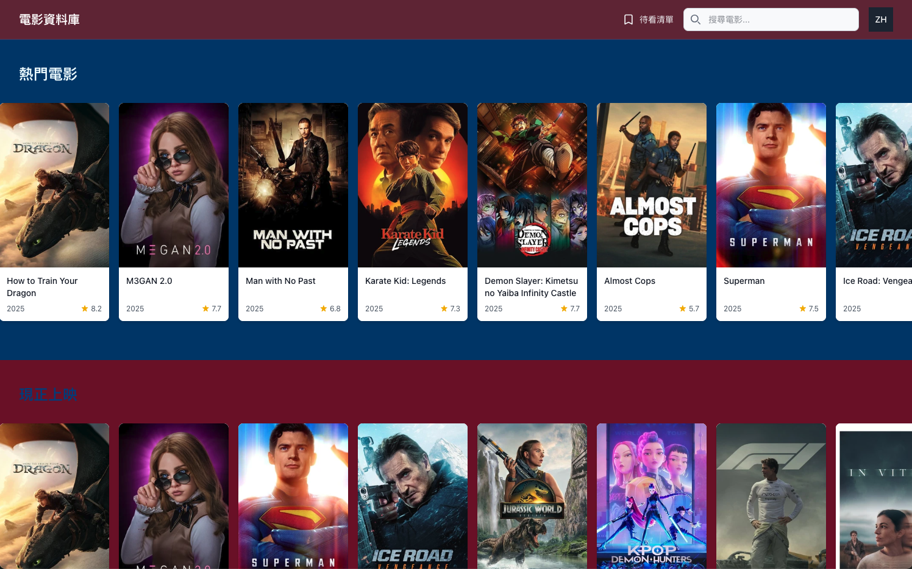

# Movie Database

[](https://reactjs.org/)
[](https://www.typescriptlang.org/)
[](https://tailwindcss.com/)
[](https://vitest.dev/)
[](https://zustand-demo.pmnd.rs/)



## 專案概述

### 主要特色

### 技術架構

- React 19
- TypeScript
- Tailwind CSS
- Zustand
- Next.js
- ESLint & Prettier
- GitHub Actions
- Vitest & Cypress
- Sentry
- Lighthouse

---

## 技術選型與架構設計說明

- Next.js：使用 Next.js 作為前端框架，提供 Server Side Rendering（SSR）
- Tailwind CSS：使用 Tailwind CSS 作為樣式框架搭配 clsx 套件產出輕量化、彈性、可擴展的樣式
- Zustand：使用 Zustand 作為輕量化的狀態管理工具
- React Query：使用 React Query 針對 API 進行快取管理
- zod：使用 zod 作為資料驗證工具，確保 API 回傳資料的正確性
- axios：使用 axios 作為 HTTP 請求工具，提供统一的 API 請求接口
- Sentry：監控使用者行為，提供錯誤回報
- Lighthouse：提供網站效能分析
- Vitest：提供單元測試
- Cypress：提供 E2E 測試
- npm-check-updates：提供自動更新依賴工具
- commit-and-tag-version：提供自動提交版本工具（考慮根據 commit message 的 type 自動更新版本）

---

## 專案結構

```
├── src/                          # 源碼目錄
│   ├── app/                      # Next.js 應用目錄
│   │   ├── [lng]/                # 多語系路由
│   │   │   ├── __tests__/        # 頁面測試
│   │   │   ├── movie/            # 電影詳情頁面
│   │   │   │   └── [id]/         # 電影 ID 路由
│   │   │   ├── search/           # 搜尋頁面
│   │   │   ├── watchlist/        # 收藏清單頁面
│   │   │   ├── layout.tsx        # 佈局元件
│   │   │   └── page.tsx          # 首頁元件
│   │   ├── i18n/                 # 國際化配置
│   │   └── global-error.tsx      # 全局錯誤處理
│   ├── components/               # React 元件
│   │   ├── __tests__/           # 元件測試檔案
│   │   ├── ui/                   # UI 基礎元件
│   │   │   ├── button.tsx
│   │   │   └── skeleton.tsx
│   │   ├── Header.tsx
│   │   ├── LanguageSelector.tsx  # 語言選擇器
│   │   ├── MovieCard.tsx        # 電影卡片元件
│   │   ├── MovieList.tsx        # 電影列表元件
│   │   ├── SearchBar.tsx        # 搜尋欄元件
│   │   ├── SortSelect.tsx       # 排序選擇元件
│   │   ├── VideoPlayer.tsx      # 影片播放器元件
│   │   └── WatchlistButton.tsx  # 收藏按鈕元件
│   ├── config/                  # 配置文件
│   │   └── routes.ts            # 路由配置
│   ├── hooks/                   # 自定義 Hooks
│   │   └── useLanguage.ts       # 語言相關 Hook
│   ├── lib/                     # 工具庫
│   │   └── utils.ts             # 通用工具函數
│   ├── locales/                 # 語言文件
│   ├── providers/               # 全局提供者
│   │   └── QueryProvider.tsx    # React Query 提供者
│   ├── query/                   # React Query 相關
│   │   └── index.ts             # Query 配置
│   ├── schemas/                 # Zod 模式定義
│   │   └── tmdb.ts              # TMDB API 模式
│   ├── services/                # 服務層
│   │   ├── http.ts              # HTTP 請求封裝
│   │   ├── tmdbValidated.ts     # TMDB API 服務 (含 Zod 驗證)
│   │   └── validatedHttp.ts     # 驗證後的 HTTP 請求
│   ├── stores/                  # 狀態管理
│   │   ├── languageStore.ts     # 語言狀態
│   │   ├── sortStore.ts         # 排序狀態
│   │   └── watchlistStore.ts    # 收藏清單狀態
│   ├── styles/                  # 樣式文件
│   ├── test/                    # 測試配置
│   ├── types/                   # TypeScript 類型
│   └── utils/                   # 工具函數
├── cypress/                     # E2E 測試
├── public/
├── scripts/                     # 腳本文件，包含自動更新依賴的腳本
├── middleware.ts
├── package.json
├── tsconfig.json
├── next.config.js
├── tailwind.config.js
└── README.md
```

## 開始使用

1. **安裝依賴**

   ```bash
   npm install
   ```

2. **開發模式**

   ```bash
   npm run dev
   ```

3. **執行測試**

   ```bash
   # 單元測試
   npm run test

   # E2E 測試
   npm run test:e2e

   # 測試覆蓋率報告
   npm run test:coverage
   ```

4. **建構專案**
   ```bash
   npm run build
   ```
